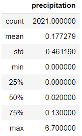

# sqlalchemy-challenge

## Analysis of Hawaii Climate Database. 

In this challenged I have conducted basic analysis and data exploration from a SQLite database using Python, SQLAlchemy ORM queries, Pandas, and Matplotlib.
## Link to Prezi Presentation: (https://prezi.com/view/lOSfHWlzNaSsjqI3qZ44/)

### Precipitation Analysis

* Plot of the last 12 months of precipiation Data 

  * Using SQLAlchemy ORM, I have designed a query in Pandas to look for the last 12 months of precipiation data and plotted the data using Matplotlib.

* Summary statistics for precipitation data.

  * Using Pandas I have created a summary statistics table for precipiation data. 

### Station Analysis

* Design a query to find the most active stations.

  * Using SQLAlchemy ORM, I have designed a query in Pandas to filter the stations by the total number of observations each station recorded.

* Design a query to retrieve the last 12 months of temperature observation data (TOBS).

  * Using SQLAlchemy ORM, I have designed a query in Pandas to look for the last 12 months of precipiation data for the station with the most observations and plotted the data using Matplotlib.

### Climate App

* Please refer to app.py to query for various climate analysis results. Routes are listed below:

  * /
  * /api/v1.0/precipitation
  * /api/v1.0/stations
  * /api/v1.0/tobs
  * /api/v1.0/<start-date>
  * /api/v1.0/<start-date>/<end-date>

 	*Note: Enter start/end dates in year-month-day format. 

